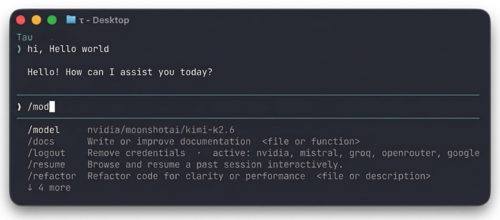

<p align="center">
  
</p>

<p align="center">
  <a href="https://pypi.org/project/tau-coding-agent/"></a>
  <a href="https://pypi.org/project/tau-coding-agent/"></a>
  <a href="https://pypi.org/project/tau-coding-agent/"></a>
  <a href="https://github.com/Jeomon/Tau/actions/workflows/ci.yml"></a>
  <a href="https://github.com/Jeomon/Tau/commits/main"></a>
  <a href="https://github.com/Jeomon/Tau/blob/main/LICENSE"></a>
</p>

Tau is a Python agent framework and coding agent, inspired by [Pi](https://github.com/earendil-works/pi). It combines an interactive terminal UI, multiple model providers, persistent sessions, tool execution, and an extension system in one package.

<p align="center">
  
</p>

## Quick start

Tau requires Python 3.12 or later.

```bash
pip install tau-coding-agent
```

Set a provider API key and start Tau:

```bash
export ANTHROPIC_API_KEY=sk-ant-...
tau
```

Google AI Studio works through the `google` provider:

```bash
export GOOGLE_API_KEY=...
tau --model google/gemini-2.5-flash
```

You can also run `/login` inside Tau to save provider credentials.

Then ask Tau to work in the current directory:

```text
Explain this repository, run its tests, and fix any failures.
```

## Common workflows

```bash
tau                                      # Start an interactive session
tau --resume                             # Resume the latest session
tau --model claude-sonnet-4-6            # Start with a specific model
tau --print "Summarize this repository"  # Run once and print the result
tau --mode json "Summarize this repo"    # Emit structured JSON events
tau --mode rpc                           # Start JSON-RPC mode for IDE clients
```

Inside an interactive session:

```text
/model       Choose a model
/resume      Resume another session
/tree        Navigate session branches
/compact     Compact a long conversation
/theme       Change the terminal theme
/login       Save provider credentials
/help        Show commands and shortcuts
```

See the [CLI reference](docs/cli-reference.md) for every option and command.

## What Tau provides

- **Interactive terminal UI** with multiline editing, searchable pickers,
  syntax highlighting, Markdown, and terminal-readable LaTeX math.
- **Multiple model providers**, including Anthropic, OpenAI, Google Gemini,
  Mistral, Ollama, Groq, xAI, Bedrock, OpenRouter, and others.
- **Persistent session trees** with resume, fork, clone, branch navigation,
  summarization, and automatic context compaction.
- **Built-in tools** for terminal commands, file operations, globbing, and
  search. Long-running terminal commands stream into one persistent output
  block.
- **Media support** for images, audio, video, and text files through file
  references, clipboard input, and the Python API.
- **Speech APIs** for text-to-speech and speech-to-text, including word or
  segment timestamps when supported by the selected provider.
- **Extensibility** through custom tools, slash commands, hooks, themes,
  skills, prompts, and in-memory Python extensions.
- **Embedding and integration** through the Python API, JSON event mode, and
  bidirectional JSON-RPC.

## Referencing files

Type `@` in the interactive editor to search for a project file:

```text
Review @src/service.py and add tests for its error handling.
```

For one-shot execution, attach a file explicitly:

```bash
tau --print --prompt "Explain this file" --file src/service.py
```

Tau also discovers project instructions from `AGENTS.md` and `CLAUDE.md`.
See [Project Context Files](docs/project-context.md) for trust and discovery
behavior.

## Authentication and configuration

Tau resolves provider credentials in this order:

1. A programmatic runtime override
2. A credential saved in `~/.tau/auth.json` (including keys saved by `/login`)
3. A provider environment variable such as `ANTHROPIC_API_KEY`,
   `OPENAI_API_KEY`, and `GOOGLE_API_KEY`

Settings are merged in this order:

1. Built-in defaults
2. `~/.tau/settings.json`
3. `.tau/settings.json`
4. Environment variables
5. Command-line options

See [Authentication](docs/auth.md), [Installation](docs/installation.md), and
[Inference Providers](docs/inference-providers.md) for provider-specific
setup.

## Documentation

- [Quickstart](docs/quickstart.md) — First session in five minutes
- [Usage](docs/usage.md) — Interactive workflows and commands
- [CLI Reference](docs/cli-reference.md) — Command-line options and modes
- [Inference Providers](docs/inference-providers.md) — Providers and speech timestamps
- [Sessions](docs/sessions.md) — Persistence, branching, and compaction
- [Tools](docs/tools.md) — Built-in and custom tools
- [Extensions](docs/extensions.md) — Tools, commands, hooks, and plugins
- [Terminal UI](docs/tui.md) — Rendering, Markdown, math, and components
- [Python API](docs/python-api.md) — Embed Tau in another application
- [Architecture](docs/architecture.md) — Internal design and data flow

The complete documentation index is available at [docs/index.md](docs/index.md).

## Install from source

```bash
git clone https://github.com/Jeomon/Tau.git
cd Tau
pip install -e .
tau
```

## Security

Tau executes enabled tools with the operating-system permissions of the process
that launched it. Review project instructions and commands before approving
work in untrusted repositories. Use a container or external sandbox when
stronger isolation is required.

Dependency versions are pinned and recorded in `uv.lock`. See
[SECURITY.md](SECURITY.md) for vulnerability reporting and supply-chain
practices.

## Development

```bash
mypy tau/
pyright tau/
ruff check tau/
ruff format tau/
python -m pytest
```

See [Development Setup](docs/development.md) and
[Contributing](CONTRIBUTING.md).

## License

Tau is licensed under the [MIT License](LICENSE).
