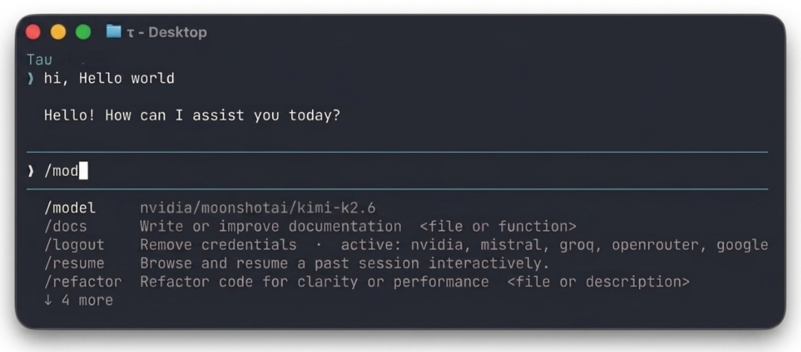

<div align="center">

  
  <br>
  <a href="https://pypi.org/project/tau-coding-agent/">
    
  </a>
  <a href="https://pepy.tech/project/tau-coding-agent">
    
  </a>
  <a href="https://github.com/Jeomon/Tau/blob/main/LICENSE">
    
  </a>
  
  <br>
  <a href="https://github.com/Jeomon/Tau/actions/workflows/ci.yml">
    
  </a>
  <a href="https://github.com/Jeomon/Tau/commits/main">
    
  </a>

</div>

<br>

Tau is a Python-based coding agent harness, inspired by [Pi](https://github.com/earendil-works/pi). It combines an interactive terminal UI, multiple model providers, persistent sessions, tool execution, and an extension system in one package.

<p align="center">
  
</p>

## Quick start

Requires Python 3.12+.

```bash
pip install tau-coding-agent
export NVIDIA_API_KEY=nvapi-...
tau --provider nvidia
```

Then ask Tau to work in the current directory:

```text
Explain this repository, run its tests, and fix any failures.
```

**Other providers:** pass `--model <provider>/<model>` with the matching API
key set, e.g. `GOOGLE_API_KEY=... tau --model google/gemini-2.5-flash`.

## Embed Tau

`Runtime` is a Python SDK for driving the agent from your own app, script, or pipeline — no terminal UI required:

```python
import asyncio
from pathlib import Path

from tau.runtime.service import Runtime
from tau.runtime.types import RuntimeConfig


async def main() -> None:
    config = RuntimeConfig(
        cwd=Path.cwd(),
        model_id="claude-sonnet-4-6",
        provider="anthropic",
        persist_session=False,
    )
    runtime = await Runtime.create(config)
    try:
        await runtime.invoke("What files are in this project?")
    finally:
        await runtime.ashutdown()


asyncio.run(main())
```

Custom tools, inline extensions, dependency injection, and event hooks all go through the same entry point — see [Python API](docs/python-api.md) for the full reference.

Want the agent/tool loop without sessions, compaction, extensions, or the TUI? `tau.engine` runs standalone — it needs only an LLM and a list of tools:

```python
import asyncio
from pathlib import Path

from tau.engine import Engine, EngineContext, EngineOptions, AgentEvent, MessageEndEvent, ToolExecutionEndEvent
from tau.inference.api.text.service import TextLLM
from tau.message.types import UserMessage


async def main() -> None:
    llm = TextLLM("claude-sonnet-4-5-20250929")
    engine = Engine(cwd=Path.cwd(), llm=llm, tools=[], options=EngineOptions(tool_timeout_seconds=60.0))

    async def on_event(event: AgentEvent) -> None:
        match event:
            case MessageEndEvent(message=message) if message is not None:
                print("assistant:", message.text_content())
            case ToolExecutionEndEvent(tool_result=result):
                print(f"tool {result.tool_name} -> error={result.is_error}")

    unsubscribe = await engine.subscribe(on_event)
    await engine.run(
        EngineContext(
            system_prompt="Answer concisely.",
            messages=[UserMessage.from_text("What does an execution engine do?")],
        )
    )
    unsubscribe()


asyncio.run(main())
```

Nothing is persisted — `engine.state.messages` is in-memory only; your app owns durable storage if it needs any. Full reference in [Engine](docs/engine.md).

Just need the model, no agent/session/tools? `tau.inference` runs standalone:

```python
import asyncio

from tau.inference import LLM, LLMContext, TextDeltaEvent
from tau.message.types import UserMessage


async def main() -> None:
    llm = LLM("claude-sonnet-4-6", provider="anthropic")
    context = LLMContext(messages=[UserMessage.from_text("Name three primes.")])
    events = await llm.invoke(context)
    print("".join(e.text.content for e in events if isinstance(e, TextDeltaEvent)))


asyncio.run(main())
```

Credentials resolve from the same sources as the CLI (`ANTHROPIC_API_KEY`, `~/.tau/auth.json`, etc.). Streaming, model listing, and the full event taxonomy are in [Inference](docs/inference.md).

## Commands

### CLI usage

```bash
tau [OPTIONS] [MESSAGE]
```

```bash
tau                                      # Start an interactive session
tau --resume                             # Resume the latest session
tau --resume abc123                      # Resume a specific session by ID
tau --model claude-sonnet-4-6            # Start with a specific model
tau --model groq/llama-3.3-70b-versatile # provider/model shorthand
tau --base-url http://localhost:8000/v1 --provider vllm  # point at a local/proxy endpoint
tau --print "Summarize this repository"  # Run once and print the result
tau --mode json --prompt "Summarize this repo"  # Emit structured JSON events
tau --mode rpc                           # Start JSON-RPC mode for IDE clients
tau --ephemeral                          # Temporary session, nothing saved
```

Common flags:

| Flag | Short | Description |
|---|---|---|
| `--prompt TEXT` | `-p` | Run a non-interactive prompt |
| `--print` | | Print mode: run `MESSAGE` and exit (shorthand for `--mode print`) |
| `--mode` | | `interactive` (default), `print`, `json`, `rpc` |
| `--provider` | | Provider to use, e.g. `anthropic`, `openai`, `groq` |
| `--model` | | Model ID, or `provider/model` shorthand |
| `--base-url URL` | | Temporarily override the provider's base URL for this run (not persisted) |
| `--resume [ID]` | `-r` | Resume the most recent or a specified session |
| `--fork ID` | | Fork a specified session at startup |
| `--ephemeral` | `-e` | Don't save this session to disk |
| `--theme` | `-t` | UI theme: `dark`, `light`, or a custom theme |
| `--cwd PATH` | `-c` | Set the working directory |
| `--output-format` | `-f` | Non-interactive output: `text` or `json` |
| `--quiet` | `-q` | Hide the non-interactive spinner |
| `--version` | `-v` | Print the installed version |
| `--help` | `-h` | Show help message |

Full flag list, environment variables, and exit codes: [CLI reference](docs/cli-reference.md).

### Subcommands

```bash
tau auth      # Manage provider credentials (login/logout, list)
tau doctor    # Diagnose config, auth, models, extensions, sessions, packages (--fix to repair)
tau install   # Install a package (extension/skill/theme)
tau remove    # Remove an installed package
tau list      # List installed packages
tau update    # Update installed packages
```

### Interactive slash commands

Type these inside an interactive session (`tau`):

| Command | What it does |
|---|---|
| `/new` | Start a fresh session |
| `/resume` | Browse and resume a past session |
| `/fork [entry-id]` | Branch the session tree at a specific entry |
| `/tree` | Navigate the session tree, switch branches |
| `/clone` | Duplicate the current session at the current position |
| `/compact` | Summarize and compact the current context |
| `/session` | Show session info, message counts, and stats |
| `/model` | Pick a model by modality |
| `/theme` | Open the theme picker |
| `/effort` | Set the thinking effort level |
| `/login` | Save credentials for a provider (API key or OAuth) |
| `/logout` | Remove stored credentials for a provider |
| `/clear` | Clear all messages from the current session |
| `/copy` | Copy the last assistant message to the clipboard |
| `/reload` | Reload extensions, skills, prompts, and settings |
| `/settings` | Show current settings |
| `/extensions` | Enable or disable extensions by scope |
| `/watch <url> [question]` | Load public video metadata/captions via `yt-dlp` |
| `/help` or `/?` | List all commands and keyboard shortcuts |
| `/quit`, `/q`, or `/exit` | Exit Tau |

Full interactive workflow guide: [Usage](docs/usage.md).

## Referencing files

Type `@` in the interactive editor to search for a project file:

```text
Review @src/service.py and add tests for its error handling.
```

For one-shot execution, attach a file explicitly:

```bash
tau -p "Explain this file" @src/service.py
```

Tau also discovers project instructions from `AGENTS.md` and `CLAUDE.md`.
See [Project Context Files](docs/project-context.md) for trust and discovery
behavior.

## Authentication and configuration

Tau resolves provider credentials in this order:

1. A programmatic runtime override
2. A credential saved in `~/.tau/auth.json` (including keys saved by `/login`)
3. A provider environment variable such as `ANTHROPIC_API_KEY`,
   `OPENAI_API_KEY`, and `GOOGLE_API_KEY`

Settings are merged in this order:

1. Built-in defaults
2. `~/.tau/settings.json`
3. `.tau/settings.json`
4. Environment variables
5. Command-line options

See [Authentication](docs/auth.md), [Installation](docs/installation.md), and
[Inference Providers](docs/inference-providers.md) for provider-specific
setup.

## Documentation

- [Quickstart](docs/quickstart.md): First session in five minutes
- [Usage](docs/usage.md): Interactive workflows and commands
- [CLI Reference](docs/cli-reference.md): Command-line options and modes
- [Inference Providers](docs/inference-providers.md): Providers and speech timestamps
- [Sessions](docs/sessions.md): Persistence, branching, and compaction
- [Tools](docs/tools.md): Built-in and custom tools
- [Extensions](docs/extensions.md): Tools, commands, hooks, and plugins
- [Terminal UI](docs/tui.md): Rendering, Markdown, math, and components
- [Python API](docs/python-api.md): Embed Tau in another application
- [Architecture](docs/architecture.md): Internal design and data flow

The complete documentation index is available at [docs/index.md](docs/index.md).

## Install from source

```bash
git clone https://github.com/Jeomon/Tau.git
cd Tau
pip install -e .
tau
```

## Security

Tau executes enabled tools with the operating-system permissions of the process
that launched it. The built-in `sandbox` extension routes terminal execution
through a `microsandbox` microVM by default, but requires the `microsandbox`
package and a supported platform. Without them it falls back to unsandboxed host
execution. Review project instructions and commands before approving work in
untrusted repositories, and verify the sandbox is actually active (`/sandbox`)
when stronger isolation matters.

Dependency versions are pinned and recorded in `uv.lock`. See
[SECURITY.md](SECURITY.md) for vulnerability reporting and supply-chain
practices.

## Development

```bash
mypy tau/
pyright tau/
ruff check tau/
ruff format tau/
python -m pytest
```

See [Development Setup](docs/development.md) and
[Contributing](CONTRIBUTING.md).

## License

Tau is licensed under the [MIT License](LICENSE).
